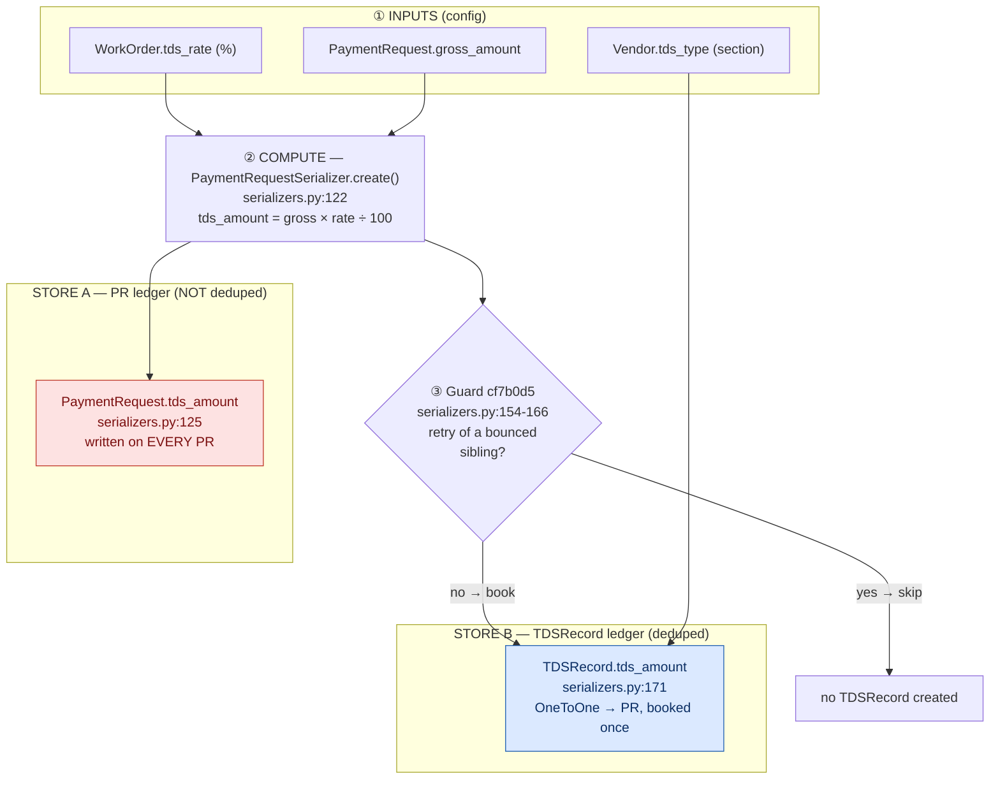
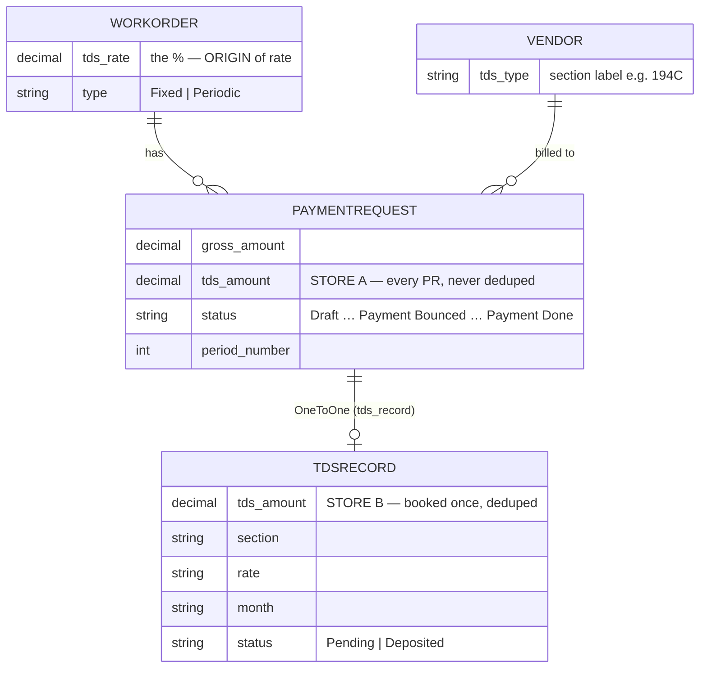
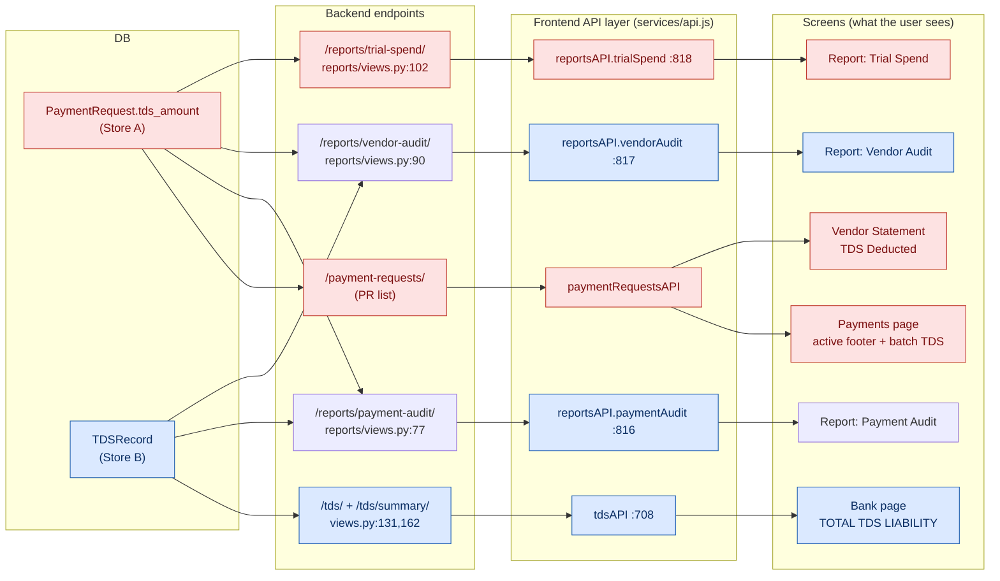
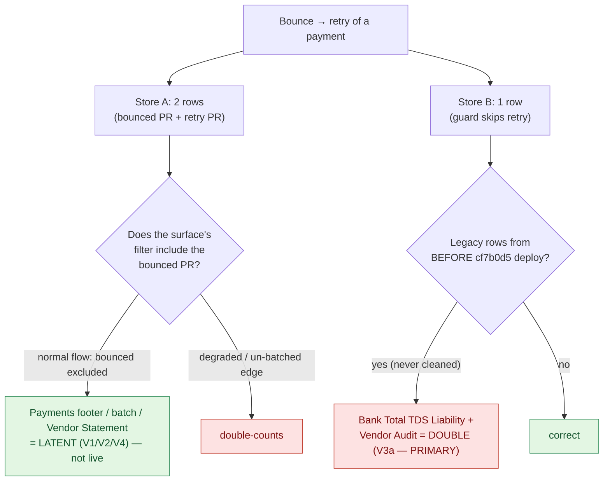

# TDS — Full Data-Flow Map

**Date:** 2026-06-23
**Method:** traced every TDS write/read site in both repos (frontend + `tta_backend`),
cited with `file:line`. No inference — each hop verified in code.
**Companion docs:** [`tds_double_count_diagnosis.md`](./tds_double_count_diagnosis.md) (the bug),
[`OPEN_ITEMS_AND_DECISIONS.md`](./OPEN_ITEMS_AND_DECISIONS.md) (D-2).

---

## TL;DR

- TDS has **one origin** (the WorkOrder rate × the payment gross) but is written into
  **two separate stores** the moment a Payment Request is created.
- **Store A — `PaymentRequest.tds_amount`:** written on *every* PR, never deduplicated.
- **Store B — `TDSRecord`:** the "booked" deduction, written once per disbursement,
  **deduplicated** by the `cf7b0d5` guard (skips a bounced-payment retry).
- All ~8 display surfaces read from **one of these two stores**. They are connected only
  at the origin; *after* storage the two ledgers can disagree — which is the whole
  double-count problem.

---

## 1. Where it originates (the inputs)

TDS is never typed in as a number. It is **derived** from two pieces of config:

| Input | Set where | Stored on | Used as |
|---|---|---|---|
| **TDS rate (%)** | Work Order form | `WorkOrder.tds_rate` | the multiplier |
| **TDS section** (e.g. `194C`) | Vendor form | `Vendor.tds_type` | the label on the booked record |
| **Gross amount** | Payment Request form | `PaymentRequest.gross_amount` | the base |

Origin of the rate in the UI: `PaymentRequestModal.jsx:358` →
`const tdsRate = parseFloat(selectedWO?.tdsRate) || 0;`

---

## 2. The compute + fork (the single most important moment)

When a Payment Request is **created**, the backend computes TDS once and forks it into
two stores in the *same* database transaction:



**Why this fork is the root of everything:** both stores start from the same number, but
Store A is written unconditionally while Store B is guarded. A bounce→retry therefore
leaves **two** rows in Store A (bounced PR + retry PR) and **one** row in Store B. Any
total built from Store A that includes both rows double-counts; Store B does not — *unless*
legacy rows pre-date the guard (see §6).

---

## 3. Where it is stored (the two tables)



- **`PaymentRequest.tds_amount`** — `payments/models.py` (PR model). One per PR. CASCADE-deleted with the PR.
- **`TDSRecord`** — `payments/models.py:74`. `OneToOneField` → PR (`:80`), so a PR has at
  most one. CASCADE-deleted with its PR. Created only at `serializers.py:171`; never updated
  except `mark_deposited` (status only, `views.py:184`).

---

## 4. How it flows back out (storage → endpoints → screens)



> Red = fed by **Store A (PR ledger)**. Blue = fed by **Store B (TDSRecord ledger)**.
> Payment Audit (U4) mixes both (`reports/views.py:84` returns *both* `paymentRequests`
> and `tdsRecords`; the screen sums PR `tdsAmount`).

---

## 5. Every place TDS is SHOWN (the full surface list)

### Aggregate / total displays (8)

| # | Surface | File:line | Reads from |
|---|---|---|---|
| 1 | Bank → **Total TDS Liability** (+ per-month + pending totals) | `BankManagementPage.jsx:279,502,565-570` | **B** TDSRecord |
| 2 | Report → **Vendor Audit** TDS total | `VendorAuditReport.jsx:132` | **B** TDSRecord |
| 3 | Payments → active-list **TDS footer** | `PaymentManagementPage.jsx:394,583` | **A** PR |
| 4 | Payments → **batch TDS total** (card + batch PDF) | `PaymentManagementPage.jsx:150,193,668,738` | **A** PR |
| 5 | **Vendor Statement** → TDS Deducted | `VendorStatementDialog.jsx:65,178` ← `paymentData.js:42` | **A** PR |
| 6 | Report → **Payment Audit** TDS total | `PaymentAuditReport.jsx:519,646` | **A** PR |
| 7 | Report → **Trial Spend** TDS total | `TrialSpendReport.jsx:98` | **A** PR |
| 8 | Excel exports (full-details, bank export) | `fullDetailsExcel.js:76`, `BankManagementPage.jsx:136` | both |

### Per-record displays (show one TDS, not a sum — not double-count-prone)

- Payment Request modal live calc — `PaymentRequestModal.jsx:359,715,862,875`
- Payment Detail dialog — `PaymentDetailDialog.jsx:221,234`
- Per-row TDS cells inside payments list, bank list, vendor statement, audit tables
- WorkOrder TDS **rate** config (`WorkOrderModal/Card/ManagementPage`), Vendor TDS **type** config (`VendorModal`, `VendorDetailView`) — settings, not amounts

---

## 6. Which surfaces the double-count actually hits



- **PRIMARY (V3a):** legacy duplicate `TDSRecord`s created before `cf7b0d5` shipped →
  show on **Bank → Total TDS Liability** and **Vendor Audit**. The code fix stopped *new*
  duplicates but **never cleaned old rows**. → fixed by `dedupe_tds_records` (see D-2).
- **LATENT (V1/V2/V4):** the PR-ledger surfaces only double in degraded mode (batch API
  fails → bounced PRs not filtered) or a manually-bounced-never-batched PR. Not the live bug.

---

## 7. Where a fix would act

| Concern | Acts on | Tool / change |
|---|---|---|
| Legacy duplicate TDSRecords (V3a) | **Store B** rows in prod DB | `audit_tds_duplicates` (read-only) → `dedupe_tds_records --apply` |
| New duplicates on bounce-retry | **Store B** create path | already fixed & live — `cf7b0d5` guard (`serializers.py:154-166`) |
| Changed-gross Fixed retry (V3b) | **Store B** guard gap | needs a unit test first; deferred |
| PR-ledger degraded-mode doubling (V1/V2) | **Store A** read filters | defensive only; low priority |

**Nothing in this document is a code change.** It is the verified map of how TDS originates,
forks into two stores, and flows back to every screen.

---

## 8. Verification — every behaviour run against the real code

Confirmed empirically by `payments/test_tds_flow_map.py` (10/10 pass) — exercises the
**actual** `PaymentRequestSerializer.create/update` + the `audit_tds_duplicates` /
`dedupe_tds_records` commands on an in-memory SQLite test DB. No mocking.

Run:
```
SECRET_KEY=test DEBUG=True DB_ENGINE=django.db.backends.sqlite3 DB_NAME=:memory: \
  python manage.py test payments.test_tds_flow_map -v2
```

| Test | Maps to | OBSERVED behaviour | Verdict |
|---|---|---|---|
| T01 | §2 fork | create → `PR.tds_amount=800` **and** 1 `TDSRecord` | as documented |
| T02 | §2 fork | rate 0 → Store A=0, **no** TDSRecord | as documented |
| T03 | §2 guard | **in-order** bounce→retry (Fixed) → **1** record | guard fires ✓ |
| **T04** | §6 **Vector 1** | retry raised **before** bounce marked → **2 records = LIVE DUPLICATE** | **bug reproduced** |
| **T05** | §6 **Vector 2** | Fixed retry with **changed gross** → **2 records**, and `audit` reports **CLEAN** | **bug + tool blind spot reproduced** |
| T06 | §2 guard | in-order Periodic retry (same period) → **1** record | guard fires ✓ |
| T07 | §3/§7 asymmetry | bounce reverses WO gross 30000→0 but **TDSRecord survives** | asymmetry confirmed |
| T08 | §6 Store A | Σ PR.tds over **all** PRs = 1200 (double); over non-bounced = 600; Store B = 600 | PR-ledger double confirmed |
| T09 | §7 tool | `audit` **flags** the Vector-1 (same-gross) duplicate | catchable ✓ |
| T10 | §7 tool | `dedupe --apply` on Vector-1 dup → 2 records reduced to **1** | cleanup works ✓ |

**Proven conclusions:**
1. `cf7b0d5` is correct **only** for the in-order path (T03, T06).
2. **Vector 1 mints a live duplicate today** (T04) — reachable whenever a retry PR is
   created before the original is flagged `Payment Bounced`.
3. **Vector 2 mints a duplicate that the cleanup tool cannot see** (T05) — silent,
   permanent overcount on Fixed-WO retries with a changed gross.
4. The PR-ledger (Store A) always carries TDS on both the bounced and retry rows (T08),
   so any sum that forgets to exclude `Payment Bounced` double-counts.
5. Bounce reverses gross but never the TDS (T07) — the two ledgers are not kept in sync.
